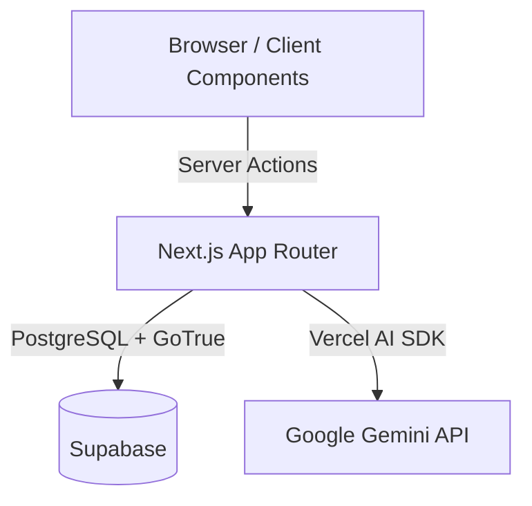

# System Architecture & Design Decisions

## 1. High-Level Architecture

Launchify AI is built on a modern Next.js 14 stack, leveraging App Router, React Server Components (RSC), and Edge middleware.

## 2. Data Flow: AI Structured Output Pipeline
One of the most complex challenges in AI applications is ensuring the LLM returns reliable, parsable data that maps to UI components.

**The Pipeline:**
1. **Prompt Engineering:** The LLM is instructed to return JSON conforming to a specific interface.
2. **Streaming:** We use `@ai-sdk/google`'s `streamObject` to stream chunks of JSON to the client.
3. **Zod Validation:** As data arrives, it is validated against `WebsiteSchema`.
4. **Dynamic Renderer:** The `SectionRenderer` maps the valid `type` fields (e.g., `"hero"`) to physical React components (`<Hero />`) via a `SectionRegistry`.

## 3. Database Architecture (Multi-tenant SaaS)
We use Supabase (PostgreSQL). To ensure this project is enterprise-ready, we implemented a Multi-tenant structure rather than a simple 1-to-1 User/Project relation.

### Entities:
- `users` (managed by Supabase Auth)
- `profiles` (1:1 with users)
- `workspaces` (1:M with projects)
- `workspace_members` (M:N linking users and workspaces with RBAC roles: Owner, Editor, Viewer)
- `projects` (belongs to workspace, contains the `content_json`)

### Row Level Security (RLS):
No backend API routes are needed for data fetching because we use RLS. 
Example Policy: *A user can only select from `projects` if their `auth.uid()` exists in `workspace_members` for that project's workspace.*

## 4. Frontend Optimization Strategy
- **Server Components by Default:** Layouts, Dashboards, and static previews are RSCs to keep bundle size near zero.
- **Debounced Local State:** For the Visual Editor, we prevent React Context re-render cascades by keeping user input in a local `useState` (in a `<DebouncedInput>` component) and only syncing to the global `EditorContext` after the user stops typing.
- **Component Registry:** We avoid massive `switch/case` statements by using an Object Map (`Record<string, React.ComponentType>`) to resolve section types in `O(1)` time.
