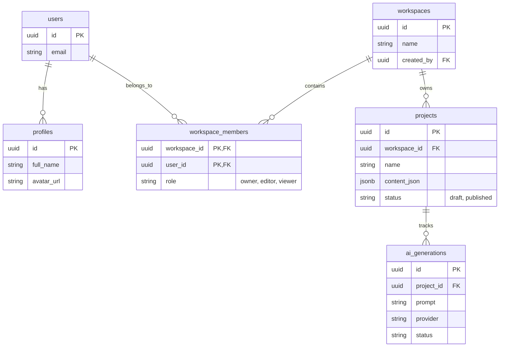

# Database Architecture & Multi-tenant Schema
**Project:** Launchify AI
**Database:** PostgreSQL (via Supabase)

## 1. Multi-Tenant Concept
Launchify AI is designed for B2B scale. A User does not own Projects directly. Instead, a User belongs to a **Workspace**, and the Workspace owns the Projects. 
This allows future scalability (e.g., inviting team members to a workspace).

## 2. Entity Relationship Diagram (ERD)

## 3. Row Level Security (RLS) Strategy
We rely on Supabase RLS at the database layer to enforce Authorization, rather than writing imperative checks in the application code.

### Example: Projects Table RLS
- **SELECT Policy:** A user can read a project ONLY IF their `auth.uid()` is present in the `workspace_members` table for that project's `workspace_id`.
- **UPDATE Policy:** A user can update a project ONLY IF their role in `workspace_members` is `owner` or `editor`. `viewer` roles are rejected by the database.

## 4. JSONB Storage
The `content_json` field in the `projects` table stores the AI-generated website structure.
- Before insertion, the Next.js backend strictly validates this JSON against the Zod `WebsiteSchema`.
- This ensures that corrupt or hallucinatory AI output never reaches the database.
